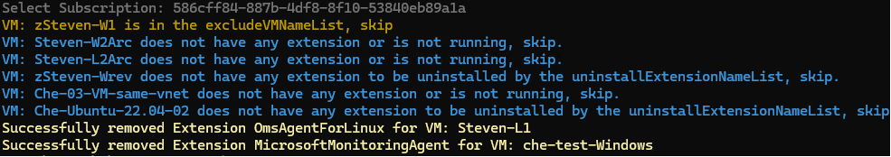

## Extension Removal for Azure VM

The PowerShell script is totally written by Steven Li(v-xiaolongli@microsoft.com) from Microsoft Azure Monitor team. If you have any questions on this script, please raise an issue or directly send me email with details.

**All scripts integrated with Az CLI is recommended(End up with 'AzCLI')**, because of its powerful parameters and capabilities.

>   [!WARNING]
>
>  Azure VMSS and Arc-enabled Servers has not been supported yet. 

------

### Introduction

These days, I have written a PowerShell script to uninstall Log Analytics Agent or other extensions from Azure VMs of Windows and Linux. After I got adequate testing on my subscription, now it could be introduced to users.

Please note that this script is written for testing and production solution purposes, which **the maximum range it can operate is all VMs within 1 subscription.** 

So please do enough testing in your subscription/resource group before using it in a production environment.

> [!Note]
>
> New Features: 
>
> 1. New version written by Az CLI has been released. It's recommended to use Az CLI version to track uninstallation status.
> 2. **Extensions will not limited to MMA/OMS**. All items listed on the extension page can be correctly triggered of uninstallation.

------

### Preparation

>  [!Caution]
>
> **Setting a testing group is literally recommended for running this script.**

Before running it from Cloud Shell, or PowerShell with Azure PowerShell / Az CLI, you may fill out some value listed at the header of script, which contains: 

1. `subscriptionId`
2.  `excludeVMNameList`
3. `uninstallExtensionNameList`
4. `resourceGroupNames` ***(Optional, leave this blank if you wish to uninstall from VMs in all resource group).***

------

### Execution

If you're running it in PowerShell 5, the color setting on output may result in error decoding. *Please remember that this script is recommended executing in CloudShell, PowerShell 7 with Az CLI or PowerShell 7 with Azure PowerShell.*

#### Screenshots

------

### Change logs

7.17 New version integrated with Az CLI has been released.

7.16 Public Release on GitHub.

4.5 Protect execution when variables haven't been set correctly.

4.4 Update for excluded VM settings.

4.1 Add jobs definition for parallel running, which can be 90% more efficient than sequential execution.